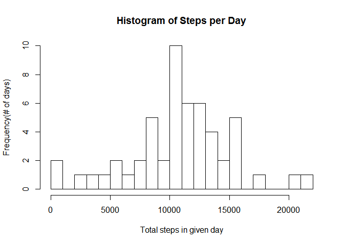
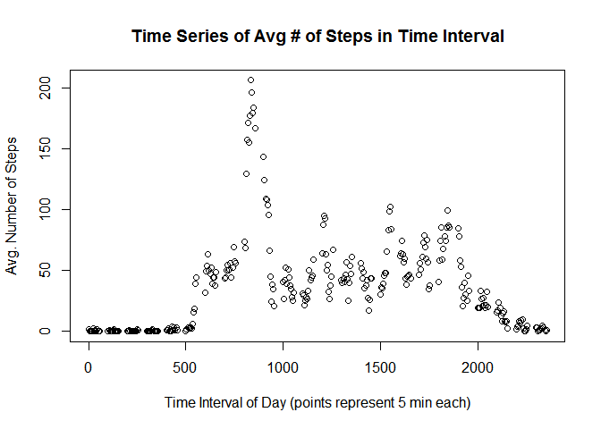
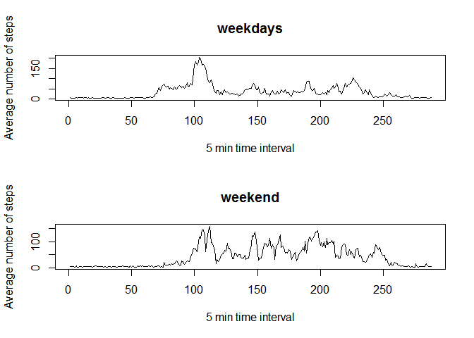

# Reproducible Research: Peer Assessment 1


```r
knitr::opts_chunk$set(echo = TRUE)
```

## Loading and preprocessing the data
Change working directory, load data, and convert from factors to dates.


```r
setwd("C:/classes/coursera/Reprod Rsch/wk 2/RepData_PeerAssessment1")
activ <- read.csv("activity.csv")
activ$fixedDate <- as.Date(activ$date)
```

## What is mean total number of steps taken per day?
Generate sums of steps per day, histogram, median, and mean.


```r
stepSum <- tapply(activ$steps, activ$date, sum)
par(mfrow = c(1, 1))
hist(stepSum, ylab="Frequency(# of days)", xlab="Total steps in given day", main="Histogram of Steps per Day", breaks=25)
```

<!-- -->

```r
stepsMean <- mean(stepSum, na.rm=T)
stepsMedian <- median(stepSum, na.rm=T)
stepsMean
```

```
## [1] 10766.19
```

```r
stepsMedian
```

```
## [1] 10765
```

## What is the average daily activity pattern?

Calculate the average number of steps in each interval of the day.
Make a time series plot of average number of steps by time intervals of the day.
Show the maximum average number of steps in a time interval.
Identify the time interval with the most average steps.


```r
averages <- aggregate(x = list(steps = activ$steps), by = list(interval = activ$interval), FUN = mean, na.rm = T)
plot(averages, main="Time Series of Avg # of Steps in Time Interval", xlab = "Time Interval of Day (points represent 5 min each)", ylab="Avg. Number of Steps")
```

<!-- -->

```r
max(averages$steps)
```

```
## [1] 206.1698
```

```r
which.max(averages$steps)
```

```
## [1] 104
```

## Imputing missing values

Show the number of NA / missing values for "steps" in the dataset.
Use strategy of filling in the avg steps/interval for that day to replace NA.  Display average steps for all time intervals.  Any remaining NA are given this average value for steps across all time intervals.


```r
sum(is.na(activ$steps))
```

```
## [1] 2304
```

```r
intervAvg <- tapply(activ$steps, activ$interval, mean, na.rm=TRUE)
mean(intervAvg)
```

```
## [1] 37.3826
```

```r
count1 = 0
count2 = 0
activ$dayAvg <- tapply(activ$steps, activ$date, mean)
for (i in 1:nrow(activ)) {
  if(is.na(activ[i, ]$steps)) {
   activ[i, ]$steps <-  activ[i, ]$dayAvg
   count1 = count1 + 1
  }
}
cat("Total ", count1, "NA values were filled in first sweep.\n\r")
```

```
## Total  2304 NA values were filled in first sweep.
## 
```

```r
for (i in 1:nrow(activ)) {
  if(is.na(activ[i, ]$steps)) {
   activ[i, ]$steps <- mean(intervAvg)
   count2 = count2 + 1
  }
}
cat("Total ", count2, "NA values filled in second sweep (may be redundant).\n\r")
```

```
## Total  301 NA values filled in second sweep (may be redundant).
## 
```


Make new dataset "newActivity" with new filled in values for NA.
Show histogram, mean, and median for new dataset including filled in values.


```r
newActivity <- data.frame("steps" = activ$steps, "date"=activ$fixedDate, "interval" = activ$interval)
stepSum2 <- tapply(newActivity$steps, newActivity$date, sum)
hist(stepSum2, ylab="Frequency(# of days)", xlab="Total steps in given day", main="Histogram of Steps per Day with Missing Data Imputed", breaks=25)
```

<!-- -->

```r
stepsMean2 <- mean(stepSum2, na.rm=T)
stepsMedian2 <- median(stepSum2, na.rm=T)
stepsMean2
```

```
## [1] 10763.67
```

```r
stepsMedian2
```

```
## [1] 10733.17
```


## Are there differences in activity patterns between weekdays and weekends?

Make data column for day of the week, and then turn into weekday/ weekend.


```r
newActivity$day <- weekdays(newActivity$date)
newActivity$day[newActivity$day == "Saturday" | newActivity$day == "Sunday" ] <- "weekend"
newActivity$day[newActivity$day == "Monday" | newActivity$day == "Tuesday" | newActivity$day == "Wednesday"| newActivity$day == "Thursday" | newActivity$day == "Friday" ] <- "weekday"
newActivity$day <- as.factor(newActivity$day)
```


Calculate average steps per time interval for weekdays vs weekends.
Make a panel plot showing the different averages for weekdays vs weekends.


```r
weekdayAvgs <- tapply(subset(newActivity, day=="weekday")$steps, subset(newActivity, day=="weekday")$interval, mean, na.rm=TRUE)
weekendAvgs <- tapply(subset(newActivity, day=="weekend")$steps, subset(newActivity, day=="weekend")$interval, mean, na.rm=TRUE)
par(mfrow = c(2, 1))
plot(weekdayAvgs, type="l", xlab="5 min time interval", ylab="Average number of steps", main="weekdays")
plot(weekendAvgs, type="l", xlab="5 min time interval", ylab="Average number of steps", main="weekend")
```

<!-- -->

